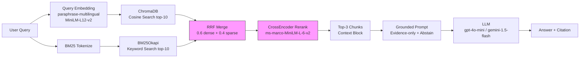

# Architecture — RAG Pipeline (Day 08 Lab)

> Mô tả thiết kế pipeline và các quyết định kỹ thuật.
> Deliverable của Documentation Owner.

## 1. Tổng quan kiến trúc

**Hệ thống:** Trợ lý nội bộ CS + IT Helpdesk — trả lời câu hỏi về chính sách,
SLA ticket, quy trình cấp quyền, và FAQ bằng chứng cứ retrieve có kiểm soát.



**Luồng chính:**
`index.py` (build một lần) → `ChromaDB` (persist) → `rag_answer.py` (query mỗi lần)
→ `eval.py` (chấm điểm toàn bộ test set)

---

## 2. Indexing Pipeline (Sprint 1)

### Tài liệu được index

| File | Source | Department | Effective Date | Số chunk (ước tính) |
|------|--------|-----------|----------------|---------------------|
| `policy_refund_v4.txt` | policy/refund-v4.pdf | CS | 2026-02-01 | ~7 |
| `sla_p1_2026.txt` | support/sla-p1-2026.pdf | IT | 2026-01-15 | ~6 |
| `access_control_sop.txt` | it/access-control-sop.md | IT Security | 2026-01-01 | ~9 |
| `it_helpdesk_faq.txt` | support/helpdesk-faq.md | IT | 2026-01-20 | ~8 |
| `hr_leave_policy.txt` | hr/leave-policy-2026.pdf | HR | 2026-01-01 | ~6 |
| **Tổng** | | | | **~36 chunks** |

### Quyết định chunking

| Tham số | Giá trị | Lý do |
|---------|---------|-------|
| Chunk size | 400 tokens (~1 600 chars) | Đủ để giữ 1 điều khoản + ngữ cảnh xung quanh mà không vượt context window |
| Overlap | 80 tokens (~320 chars) | Tránh mất thông tin ở ranh giới chunk; giữ 1-2 paragraph cuối |
| Primary boundary | Section heading `=== ... ===` | Documents đều có cấu trúc section rõ ràng — cắt theo section giữ nguyên một điều khoản trong 1 chunk |
| Secondary boundary | Paragraph (`\n\n`) với overlap | Nếu section > 1 600 chars mới split tiếp; không cắt ngang câu |
| Fallback | Character-based | Chỉ dùng khi 1 paragraph đơn lẻ > chunk_chars |

**Tại sao KHÔNG dùng fixed-token chunking:**
Các document có điều khoản ngắn (1-4 dòng). Fixed-token cắt ngang giữa điều khoản →
retriever lấy chunk thiếu ngữ cảnh → generation hallucinate phần còn lại.

### Embedding model

| Tham số | Giá trị |
|---------|---------|
| Model (default) | `paraphrase-multilingual-MiniLM-L12-v2` (Sentence Transformers) |
| Model (nếu có API key) | `text-embedding-3-small` (OpenAI) |
| Vector dims | 384 (ST) / 1 536 (OpenAI) |
| Vector store | ChromaDB `PersistentClient` |
| Similarity metric | Cosine (`hnsw:space = cosine`) |
| Lý do chọn ST | Hỗ trợ tiếng Việt, chạy local không cần API key, đủ chất lượng cho corpus nội bộ |

---

## 3. Retrieval Pipeline (Sprint 2 + 3)

### Baseline (Sprint 2) — Dense only

| Tham số | Giá trị |
|---------|---------|
| Strategy | Dense (cosine similarity trên embeddings) |
| Top-k search | 10 |
| Top-k select | 3 |
| Rerank | Không |

**Điểm yếu quan sát:**
- Query dùng alias/tên cũ ("Approval Matrix") → dense miss vì tên mới là "Access Control SOP"
- Query có mã kỹ thuật ("ERR-403", "P1") → dense có thể ưu tiên chunk theo nghĩa hơn exact term

### Variant (Sprint 3) — Hybrid + CrossEncoder Rerank

| Tham số | Giá trị | Thay đổi so với baseline |
|---------|---------|------------------------|
| Strategy | Hybrid (dense + BM25) | Dense → Hybrid |
| Dense weight | 0.6 | Mới |
| Sparse weight | 0.4 (BM25Okapi) | Mới |
| RRF constant k | 60 (chuẩn theo paper) | Mới |
| Top-k search | 10 | Giữ nguyên |
| Top-k select | 3 | Giữ nguyên |
| Rerank | CrossEncoder `ms-marco-MiniLM-L-6-v2` | Thêm mới |

**Lý do chọn Hybrid + Rerank (2 biến — xem tuning-log.md về A/B):**

Hybrid:
- Corpus có cả ngôn ngữ tự nhiên (policy paragraph) lẫn keyword kỹ thuật
  (P1, Level 3, ERR-403, "Approval Matrix").
- BM25 bắt được exact match mà dense embedding bỏ sót khi query dùng alias.

CrossEncoder Rerank:
- Sau hybrid, top-10 vẫn có noise (chunks liên quan chủ đề nhưng không trả lời câu hỏi cụ thể).
- CrossEncoder chấm lại (query, chunk) cùng lúc → chính xác hơn bi-encoder ở bước rerank.

---

## 4. Generation (Sprint 2)

### Grounded Prompt Template

```
Answer only from the retrieved context below.
If the context is insufficient, say you do not know and do not make up information.
Cite the source field (in brackets like [1]) when possible.
Keep your answer short, clear, and factual.
Respond in the same language as the question.

Question: {query}

Context:
[1] {source} | {section} | score={score}
{chunk_text}

[2] ...

Answer:
```

**4 quy tắc grounding (từ slide):**

| Quy tắc | Cách implement |
|---------|----------------|
| Evidence-only | Câu đầu prompt: "Answer only from the retrieved context" |
| Abstain | "If the context is insufficient, say you do not know" |
| Citation | "Cite the source field (in brackets like [1])" |
| Stable output | `temperature=0`, `max_tokens=512` |

### LLM Configuration

| Tham số | Giá trị |
|---------|---------|
| Primary | OpenAI `gpt-4o-mini` (nếu OPENAI_API_KEY) |
| Fallback | Google `gemini-1.5-flash` (nếu GOOGLE_API_KEY) |
| Temperature | 0 (output ổn định, reproducible cho eval) |
| Max tokens | 512 |

---

## 5. Failure Mode Checklist

| Failure Mode | Triệu chứng | Cách kiểm tra |
|-------------|-------------|---------------|
| Index lỗi / thiếu doc | Retrieve về chunk sai source | `inspect_metadata_coverage()` trong index.py |
| Chunking cắt ngang điều khoản | Chunk thiếu điều kiện ngoại lệ | `list_chunks()` + đọc text preview |
| Retrieval bỏ sót expected source | context_recall thấp | `score_context_recall()` trong eval.py |
| Generation hallucinate | faithfulness thấp, bịa con số | `score_faithfulness()` trong eval.py |
| Token overload (lost in the middle) | Answer bỏ sót chunk [2] | Kiểm tra `len(context_block)` |
| Alias / tên cũ miss | Dense không tìm được doc đổi tên | Thêm hybrid; kiểm tra q07 trong test set |

---

## 6. Query Transformation (Sprint 3 — optional)

Ngoài hybrid + rerank, `transform_query()` hỗ trợ thêm 3 strategy:

| Strategy | Khi dùng | Ví dụ |
|----------|---------|-------|
| `expansion` | Query dùng alias, tên cũ | "Approval Matrix" → thêm "Access Control SOP" |
| `decomposition` | Query hỏi nhiều thứ | "Điều kiện remote và giới hạn VPN?" → 2 sub-queries |
| `hyde` | Query mơ hồ, abstract | Sinh câu trả lời giả để embed thay query |
